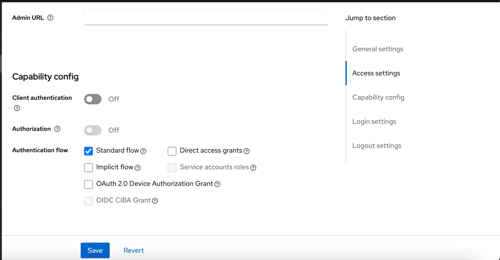

# Keycloak Angular Sample

This project was generated with [Angular CLI](https://github.com/angular/angular-cli) version 17.3.0.

## Development server

Run `ng serve` for a dev server. Navigate to `http://localhost:4200/`. The application will automatically reload if you change any of the source files.

## Build

Run `ng build` to build the project. The build artifacts will be stored in the `dist/` directory.


## Run keycloak instance with docker  

keycloak version 24.0.1

run with command
```
docker run -p 5776:8080 -e KEYCLOAK_ADMIN=admin -e KEYCLOAK_ADMIN_PASSWORD=admin quay.io/keycloak/keycloak:24.0.1 start-dev
```

##  Realm config

add camelsolution  realm 


##  Clients  configs

create two client `frontEnd` and `login-app`


`frontEnd`  client config :
 

`login-app` config :


##  keycloak JS

Keycloak JS in downloaded from
http://localhost:5776/js/keycloak.js

add it to your project

##  Backend  spring boot sample example 

you can use this project as backend example connected to `login-app` client

https://github.com/aliounedenna/keyclock-springboot-sample

